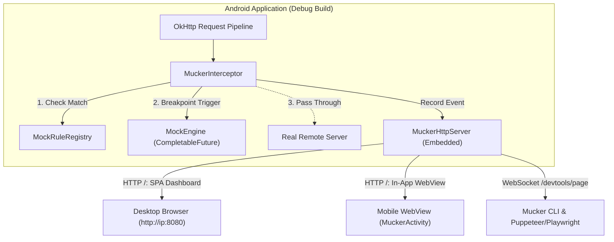
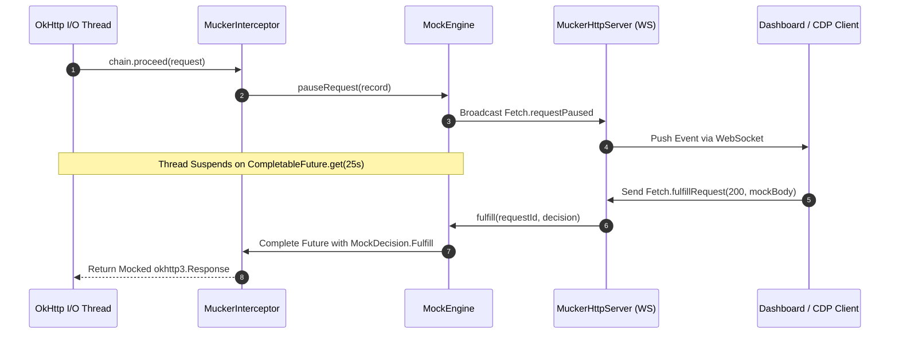

## 1. System Topology

Mucker decouples the developer experience into three distinct, interoperable layers:



### Breakpoint Interception Sequence



---

## 2. OkHttp Interception & Threading Safety

### A. The Non-Blocking Synchronization Challenge
When an OkHttp request is in flight, it executes on an I/O thread managed by OkHttp's `Dispatcher`. If a breakpoint is active:
* The thread must be paused without causing memory leaks or permanent deadlocks.
* A developer may close their browser or disconnect their phone, which must not crash the host app.

### B. `CompletableFuture<MockDecision>` with Safe Timeout
Mucker coordinates thread pausing using `CompletableFuture`:

```kotlin
// Inside MuckerInterceptor:
if (engine.shouldIntercept(url)) {
    val future = engine.pauseRequest(record)
    val decision = try {
        // Safe timeout: defaults to 25 seconds
        future.get(timeoutSeconds, TimeUnit.SECONDS)
    } catch (e: TimeoutException) {
        // Fallback to real network so thread is never hung forever
        MockDecision.Continue
    }
    
    when (decision) {
        is MockDecision.Fulfill -> return buildMockResponse(chain, decision)
        is MockDecision.Continue -> return chain.proceed(request)
        is MockDecision.Fail -> throw IOException(decision.errorReason)
    }
}
```

* **Zero Leaks**: When interception is disabled or timed out, all unresolved futures are immediately transitioned to `MockDecision.Continue`.
* **Zero JNI/Native Hooks**: No memory inspection, ART runtime tampering, or byte-code manipulation.

---

## 3. The Embedded Micro Server

Instead of bundling a large external web server framework that might introduce dependency conflicts, Mucker embeds a clean, robust Java `ServerSocket` implementation:

* **Footprint**: Under 15KB of compiled bytecode.
* **HTTP 1.1 Support**:
  * Static file delivery from Android assets (`assets/mucker-web/index.html`).
  * Cross-Origin Resource Sharing (CORS) preflight headers (`Access-Control-Allow-Origin: *`).
* **RFC 6455 WebSocket Framing**:
  * Handshake SHA-1 `Sec-WebSocket-Accept` computation.
  * Framing with mask decoding, ping/pong, and text frame broadcasting.
* **JSON-RPC 2.0 Dispatcher**:
  * Routes `Fetch.enable`, `Fetch.fulfillRequest`, `Fetch.continueRequest`, and `Fetch.failRequest`.

---

## 4. Release Build Stripping (`mucker-noop`)

In production environments, security and app size are critical:
* `mucker-noop` exports the identical public method signatures (`Mucker.install()`, `Mucker.interceptor`).
* Its `MuckerInterceptor` executes a single instruction:
  ```kotlin
  override fun intercept(chain: Interceptor.Chain): Response = chain.proceed(chain.request())
  ```
* Proguard / R8 can inline or eliminate unused code, resulting in **zero server sockets**, **zero web assets**, and **zero security exposure** in release APKs.
