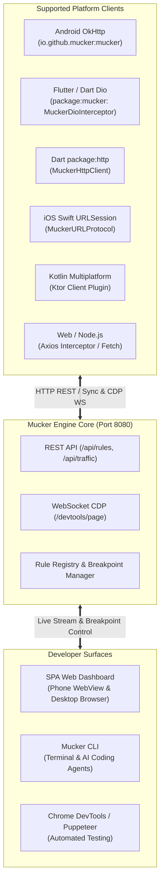

While Mucker originated as an in-app mocking companion for Android OkHttp, its underlying engine is **strictly platform-agnostic**.

The Mucker engine exposes standard HTTP REST and Chrome DevTools Protocol (CDP) WebSocket interfaces. **Any HTTP client on any operating system** that supports an interceptor, middleware, or proxy protocol can seamlessly participate in Mucker's zero-certificate mocking and live inspection ecosystem.



---

## 1. Flutter & Dart: `dio` & `http` Interceptors

Mucker provides first-class support for Flutter applications using [`dio`](https://pub.dev/packages/dio) and standard [`http`](https://pub.dev/packages/http) via the [`mucker`](https://github.com/yongjhih/mucker/tree/main/dart/mucker) Dart package.

### Installation

Add `mucker` to your Flutter / Dart `pubspec.yaml`:

```yaml
dependencies:
  dio: ^5.4.0
  mucker:
    path: ./dart/mucker  # or git repository
```

### Usage with Dio

Simply register `MuckerDioInterceptor` in your Dio instance:

```dart
import 'package:dio/dio.dart';
import 'package:mucker/dio.dart';

final dio = Dio();

// Attach Mucker Interceptor
dio.interceptors.add(
  MuckerDioInterceptor(
    autoSyncRules: true,   // Dynamically sync rules from Mucker Dashboard
    reportTelemetry: true, // Stream full requests & payloads to Mucker Dashboard
    breakpointMode: true,  // Pause requests for live developer action in Dashboard
  ),
);

// All network requests will now be evaluated against Mucker rules!
final response = await dio.get('https://api.example.com/v1/user/profile');
print(response.data);
print(response.headers.value('X-Mocked-By')); // "MuckerDioInterceptor"
```

### Features Supported in Dio:
* **Automatic Android Host Resolution**: Automatically resolves `http://10.0.2.2:8080` on Android emulators and `http://127.0.0.1:8080` on iOS/desktop without hardcoding IPs.
* **Live Breakpoint Mode**: Pauses outgoing Dio requests, alerts the Mucker Dashboard, and allows you to fulfill with custom mock JSON or continue to the real network.
* **Chaos / Fault Injection**: Injects connection timeouts (`DioExceptionType.connectionTimeout`) and connection errors for automated CI/CD chaos testing.
* **Full Inspection Telemetry**: Captures request headers, query params, request body (`data`), response headers, status code, and latency in real time.


### Usage with `package:http`

If your Flutter application uses the official `package:http`:

```dart
import 'package:http/http.dart' as http;
import 'package:mucker/mucker.dart';

final client = MuckerHttpClient(
  innerClient: http.Client(),
  serverUrl: 'http://127.0.0.1:8080',
);

// Drop-in replacement for standard http client
final response = await client.get(Uri.parse('https://api.example.com/items'));
print(response.body);
```

---

## 2. iOS: Swift & `URLSession`

On iOS, Mucker integrates via Apple's standard `URLProtocol`. This intercepts all network traffic flowing through `URLSession` without modifying existing API calls:

```swift
import Foundation

public class MuckerURLProtocol: URLProtocol {
    public static var muckerServerUrl = "http://127.0.0.1:8080"
    
    override public class func canInit(with request: URLRequest) -> Bool {
        // Avoid recursive loops
        guard URLProtocol.property(forKey: "MuckerHandled", in: request) == nil else {
            return false
        }
        return true
    }
    
    override public class func canonicalRequest(for request: URLRequest) -> URLRequest {
        return request
    }
    
    override public func startLoading() {
        guard let mutableRequest = (request as NSURLRequest).mutableCopy() as? NSMutableURLRequest else { return }
        URLProtocol.setProperty(true, forKey: "MuckerHandled", in: mutableRequest)
        
        // Query Mucker local engine rules or forward
        checkMuckerRules(for: request) { [weak self] mockData, statusCode, headers in
            guard let self = self else { return }
            
            if let mockData = mockData {
                let response = HTTPURLResponse(
                    url: self.request.url!,
                    statusCode: statusCode,
                    httpVersion: "HTTP/1.1",
                    headerFields: headers
                )!
                self.client?.urlProtocol(self, didReceive: response, cacheStoragePolicy: .notAllowed)
                self.client?.urlProtocol(self, didLoad: mockData)
                self.client?.urlProtocolDidFinishLoading(self)
            } else {
                // Pass through to real network
                let task = URLSession.shared.dataTask(with: mutableRequest as URLRequest) { data, response, error in
                    if let response = response { self.client?.urlProtocol(self, didReceive: response, cacheStoragePolicy: .notAllowed) }
                    if let data = data { self.client?.urlProtocol(self, didLoad: data) }
                    if let error = error { self.client?.urlProtocol(self, didFailWithError: error) }
                    self.client?.urlProtocolDidFinishLoading(self)
                }
                task.resume()
            }
        }
    }
    
    override public func stopLoading() {}
}

// Enable globally in AppDelegate or SceneDelegate:
URLProtocol.registerClass(MuckerURLProtocol.self)
```

---

## 3. Kotlin Multiplatform (KMP) & Ktor

For cross-platform desktop, mobile, and web apps built with **Ktor Client**:

```kotlin
import io.ktor.client.*
import io.ktor.client.plugins.api.*
import io.ktor.client.statement.*
import io.ktor.http.*

val MuckerKtorPlugin = createClientPlugin("MuckerPlugin") {
    on(Send) { request ->
        val url = request.url.toString()
        val method = request.method.value

        // Check Mucker local engine rules
        val matchedRule = queryMuckerRule(url, method)
        if (matchedRule != null) {
            // Return synthetic HttpResponseData
            return@on createMockResponse(
                statusCode = HttpStatusCode.fromValue(matchedRule.statusCode),
                body = matchedRule.responseBody,
                headers = headersOf("X-Mocked-By" to listOf("MuckerKtor"))
            )
        }

        // Pass through to actual network engine
        proceed(request)
    }
}

val httpClient = HttpClient {
    install(MuckerKtorPlugin)
}
```

---

## 4. Web & Node.js: Axios Interceptor

For frontend web applications or Node.js backends:

```javascript
import axios from 'axios';

export function attachMucker(axiosInstance, muckerHost = 'http://localhost:8080') {
  axiosInstance.interceptors.request.use(async (config) => {
    try {
      const { data: rules } = await axios.get(`${muckerHost}/api/rules`, { timeout: 300 });
      const matched = rules.find(r => r.isEnabled && new RegExp(r.urlPattern).test(config.url));
      
      if (matched) {
        // Return synthetic response adapter
        config.adapter = () => Promise.resolve({
          data: JSON.parse(matched.responseBody),
          status: matched.statusCode,
          statusText: 'OK',
          headers: { ...matched.responseHeaders, 'x-mocked-by': 'MuckerAxios' },
          config
        });
      }
    } catch (_) {
      // Server offline; proceed normally
    }
    return config;
  });
}
```

---

## Protocol Compatibility Matrix

| Client Platform | Interceptor Type | Zero Certs Required | Live Breakpoints | Dashboard Telemetry |
| :--- | :--- | :---: | :---: | :---: |
| **Android (OkHttp)** | Native Application Interceptor | Yes | Yes | Yes |
| **Flutter / Dart (Dio)** | `Dio.Interceptor` | Yes | Yes | Yes |
| **Dart (`package:http`)** | `http.BaseClient` | Yes | Yes | Yes |
| **iOS (URLSession)** | `URLProtocol` | Yes | Yes | Yes |
| **Kotlin Multiplatform** | `Ktor ClientPlugin` | Yes | Yes | Yes |
| **Web & Node (Axios)** | `Axios.interceptors` | Yes | Yes | Yes |

---

## Summary

Mucker is **not** tied to a single platform or HTTP library. By leveraging standard interceptors and a headless HTTP/CDP server, you can orchestrate network mocking across your entire mobile and web stack with zero certificates and zero headaches.
