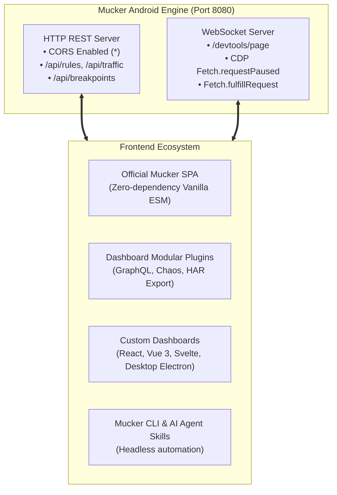

Mucker is designed with a **Headless & Protocol-First Architecture**. The embedded Android engine makes no assumptions about how you inspect or mock your network traffic.

The bundled SPA dashboard in `dashboard/index.html` is merely *one* client consuming standard HTTP REST and WebSocket APIs. We actively encourage developers and teams to:
1. **Extend the built-in dashboard** with custom tabs, metrics widgets, or protocol parsers (GraphQL, Protobuf, gRPC-Web).
2. **Build an entirely custom dashboard** using React, Vue, Svelte, or Next.js.
3. **Bundle custom frontends** into the Android APK by replacing the static web assets.



---

## 1. Mucker Dashboard Architecture: Modular & Headless

Mucker's HTTP server includes full **Cross-Origin Resource Sharing (CORS)** support by default:
```http
Access-Control-Allow-Origin: *
Access-Control-Allow-Methods: GET, POST, PUT, DELETE, OPTIONS
Access-Control-Allow-Headers: Content-Type, Authorization
```

This means your custom dashboard can run locally on `http://localhost:3000` (e.g., Vite, Webpack dev server) and connect directly to your Android device or emulator at `http://localhost:8080` without proxy configuration.

---

## 2. Developing Modular Panels for the Dashboard

The official dashboard provides an extensible plugin lifecycle. You can inject custom tabs, toolbar actions, or request inspectors.

### Plugin Lifecycle Interface

```javascript
/**
 * @typedef {Object} MuckerPlugin
 * @property {string} id - Unique plugin identifier
 * @property {string} name - Display name for tab/button
 * @property {string} icon - SVG or emoji icon
 * @property {function(HTMLElement, Object): void} init - Invoked on dashboard load
 * @property {function(Object): void} onRequest - Invoked on every intercepted request
 * @property {function(Object): void} onResponse - Invoked on every completed response
 */
```

### Example: Custom GraphQL Inspector Plugin

This modular plugin automatically detects GraphQL requests, formats operations, and adds a dedicated "GraphQL" tab:

```javascript
// plugins/graphql-inspector.js
(function(window) {
  const GraphQLPlugin = {
    id: 'graphql-inspector',
    name: 'GraphQL',
    icon: '⚡',

    init(container, state) {
      container.innerHTML = `
        <div class="graphql-panel">
          <div class="panel-header">
            <h3>GraphQL Operation Inspector</h3>
            <span class="badge">Live Stream</span>
          </div>
          <div id="gqlList" class="gql-list">
            <p class="text-dim">Waiting for GraphQL queries or mutations...</p>
          </div>
        </div>
      `;
    },

    onRequest(record) {
      if (!record.postData) return;
      try {
        const payload = JSON.parse(record.postData);
        if (payload.query || payload.operationName) {
          const list = document.getElementById('gqlList');
          const item = document.createElement('div');
          item.className = 'gql-item';
          item.innerHTML = `
            <div class="gql-row">
              <span class="gql-type">${payload.query?.trim().startsWith('mutation') ? 'MUTATION' : 'QUERY'}</span>
              <strong class="gql-name">${payload.operationName || 'Anonymous'}</strong>
              <span class="gql-url">${record.url}</span>
            </div>
            <pre class="gql-body"><code>${escapeHtml(payload.query || '')}</code></pre>
          `;
          list.prepend(item);
        }
      } catch (err) {
        // Not a JSON payload
      }
    }
  };

  window.MuckerDashboard?.registerPlugin(GraphQLPlugin);
})(window);
```

### Example: Chaos & Latency Simulator Plugin

Inject artificial jitter, 500 internal server errors, or simulate flaky mobile connections:

```javascript
// plugins/chaos-simulator.js
(function(window) {
  const ChaosPlugin = {
    id: 'chaos-simulator',
    name: 'Chaos Engine',
    icon: '🎲',

    init(container, state) {
      container.innerHTML = `
        <div class="card p-4">
          <h3>Network Chaos Simulator</h3>
          <p class="text-muted">Simulate poor mobile network conditions dynamically.</p>
          
          <div class="form-group mt-3">
            <label>Failure Rate (% of requests returning 500):</label>
            <input type="range" id="chaosRate" min="0" max="100" value="0" class="slider" />
            <span id="rateLabel">0%</span>
          </div>

          <div class="form-group mt-3">
            <label>Artificial Latency (ms):</label>
            <input type="number" id="chaosLatency" value="0" class="input" />
          </div>

          <button id="btnApplyChaos" class="btn btn-primary mt-3">Apply Chaos Rules</button>
        </div>
      `;

      document.getElementById('btnApplyChaos').addEventListener('click', async () => {
        const latency = Number(document.getElementById('chaosLatency').value);
        await fetch('/api/rules', {
          method: 'POST',
          headers: { 'Content-Type': 'application/json' },
          body: JSON.stringify({
            id: 'chaos_latency_rule',
            urlPattern: '.*',
            method: 'ALL',
            delayMs: latency,
            isEnabled: latency > 0
          })
        });
        showToast('Chaos configuration updated!', 'warning');
      });
    }
  };

  window.MuckerDashboard?.registerPlugin(ChaosPlugin);
})(window);
```

---

## 3. Building Your Own Custom Dashboard (React, Vue, Svelte)

You are not locked into the default HTML interface. You can create a rich React or Vue application and connect to Mucker's APIs.

### Minimal React Hooks Client

```tsx
import React, { useEffect, useState } from 'react';

interface MockRule {
  id: string;
  urlPattern: string;
  method: string;
  statusCode: number;
  delayMs: number;
  responseBody: string;
  isEnabled: boolean;
}

export function useMucker(muckerHost: string = 'http://localhost:8080') {
  const [rules, setRules] = useState<MockRule[]>([]);
  const [traffic, setTraffic] = useState<any[]>([]);
  const [isBreakpointActive, setBreakpointActive] = useState(false);

  // Fetch initial rules
  const refreshRules = async () => {
    const res = await fetch(`${muckerHost}/api/rules`);
    const data = await res.json();
    setRules(data);
  };

  // Add or update rule
  const saveRule = async (rule: MockRule) => {
    await fetch(`${muckerHost}/api/rules`, {
      method: 'POST',
      headers: { 'Content-Type': 'application/json' },
      body: JSON.stringify(rule),
    });
    refreshRules();
  };

  // Connect WebSocket for live events
  useEffect(() => {
    refreshRules();

    const wsUrl = muckerHost.replace(/^http/, 'ws') + '/devtools/page';
    const ws = new WebSocket(wsUrl);

    ws.onmessage = (event) => {
      const msg = JSON.parse(event.data);
      if (msg.method === 'Fetch.requestPaused') {
        console.log('Breakpoint intercepted request:', msg.params);
      } else if (msg.method === 'Mucker.requestRecorded') {
        setTraffic((prev) => [msg.params, ...prev.slice(0, 199)]);
      }
    };

    return () => ws.close();
  }, [muckerHost]);

  return { rules, traffic, isBreakpointActive, saveRule, refreshRules };
}
```

---

## 4. Bundling Your Custom Dashboard into the Android APK

If you want your custom frontend to be served **inside the Android app** (via the In-App WebView notification or `http://<phone-ip>:8080`):

1. Build your single-page app into a static directory (e.g. `dist/` or `build/`):
   ```bash
   npm run build
   ```
2. Copy the generated `index.html` (and bundled CSS/JS) into:
   ```
   mucker/src/main/assets/mucker-web/index.html
   ```
3. Rebuild your Android debug APK:
   ```bash
   ./gradlew :app:assembleDebug
   ```
4. Whenever the app launches, `MuckerHttpServer` will automatically serve your custom UI directly from assets!

---

## 5. Complete REST & WebSocket Protocol Specification

### REST API Reference

| Endpoint | Method | Description | Request Body |
| :--- | :--- | :--- | :--- |
| `/api/status` | `GET` | Get engine health, active rules count, client count | None |
| `/api/rules` | `GET` | List all configured mock rules | None |
| `/api/rules` | `POST` | Add or update a mock rule | `MockRule` JSON |
| `/api/rules?id=<id>` | `DELETE`| Remove a specific rule | None |
| `/api/rules` | `DELETE`| Clear all rules | None |
| `/api/traffic` | `GET` | Retrieve intercepted traffic history | None |
| `/api/traffic` | `DELETE`| Clear traffic history | None |
| `/api/breakpoints` | `GET` | List currently suspended requests | None |
| `/api/breakpoints/fulfill` | `POST` | Fulfill paused request with mock response | `{ requestId, statusCode, body, headers }` |
| `/api/breakpoints/continue`| `POST` | Release paused request to real network | `{ requestId }` |
| `/api/config/breakpoint` | `POST` | Toggle global breakpoint interception | `{ enabled: boolean }` |

### CDP WebSocket Wire Protocol (`/devtools/page`)

Mucker's WebSocket implements the Chrome DevTools Protocol **Fetch Domain**:

#### Request Paused Event (Server -> Client)
```json
{
  "method": "Fetch.requestPaused",
  "params": {
    "requestId": "req_171092849",
    "request": {
      "url": "https://api.example.com/v1/checkout",
      "method": "POST",
      "headers": { "Content-Type": "application/json" },
      "postData": "{\"amount\": 99.00}"
    },
    "resourceType": "XHR"
  }
}
```

#### Fulfill Request Command (Client -> Server)
```json
{
  "id": 42,
  "method": "Fetch.fulfillRequest",
  "params": {
    "requestId": "req_171092849",
    "responseCode": 200,
    "responseHeaders": [
      { "name": "Content-Type", "value": "application/json" },
      { "name": "X-Mocked-By", "value": "CustomDashboard" }
    ],
    "body": "eyJzdGF0dXMiOiAic3VjY2VzcyIsICJvcmRlcklkIjogMzg5Mn0="
  }
}
```
*(Note: `body` is Base64-encoded UTF-8 string per standard CDP specification).*

#### Continue Request Command (Client -> Server)
```json
{
  "id": 43,
  "method": "Fetch.continueRequest",
  "params": {
    "requestId": "req_171092849"
  }
}
```

---

## Summary

With Mucker's decoupled architecture:
* You are not trapped in a proprietary closed-source UI.
* You can write plugins in standard JavaScript in minutes.
* You can build enterprise-grade QA tools using modern web frameworks.
* You can automate tests via Puppeteer, Playwright, or AI agents using the exact same APIs.
