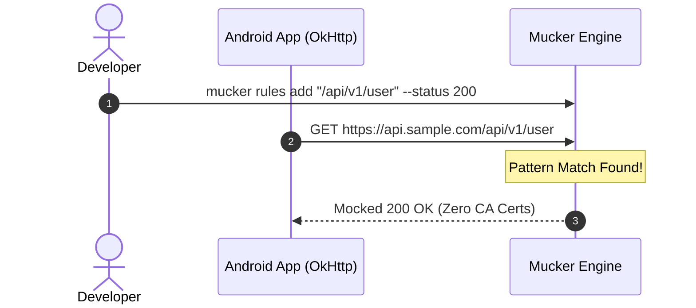

## 1. Instant 60-Second Demo (No Setup Required)

Want to see Mucker in action immediately before adding dependencies to your project? We provide a **fully automated one-line runner** as well as a **1-click cloud Dev Container** requiring zero local tools:

### Option A: Local One-Line Runner (Automatic Emulator & Browser Launch)

If you have an Android device or emulator running locally on macOS or Linux:

```bash
git clone https://github.com/yongjhih/mucker.git
cd mucker
npm run demo
# or: ./scripts/quickstart.sh
```

**What happens automatically:**
1. Detects your connected Android device/emulator (or automatically launches a local AVD if none is active).
2. Compiles and installs the demo Android app (`:app:installDebug`).
3. Establishes port forwarding (`adb forward tcp:8080 tcp:8080`).
4. Launches `MainActivity` on the Android screen.
5. Opens `http://localhost:8080` in your default desktop browser.

> [!TIP]
> **Try this in the Demo:**
> 1. Tap **"1. GET /api/v1/user/profile"** on the Android screen.
> 2. Watch the request appear in real time on the desktop dashboard timeline with bi-directional hover highlighting.
> 3. Click the request, **directly edit the JSON response** in the CodeMirror editor (no button required), and press `⌘S` or `Ctrl+Enter`.
> 4. Tap the button again on the Android phone — your mocked JSON payload is served immediately!

<div class="browser-frame" style="margin: 24px 0;">
  <div class="browser-header">
    <span class="term-dot red"></span>
    <span class="term-dot yellow"></span>
    <span class="term-dot green"></span>
    <div class="browser-address">http://localhost:8080 — Mucker Web Dashboard</div>
  </div>
  
</div>

---

### Option B: Zero-Install Cloud Dev Container (GitHub Codespaces)

Don't have Android Studio, JDK 17, or the Android SDK installed on your workstation? You can experience Mucker with 100% cloud execution in your browser:

[](https://codespaces.new/yongjhih/mucker)

- **Pre-configured Stack**: Ubuntu 24.04 LTS, OpenJDK 17, Android SDK 34 (`build-tools 34.0.0`, `platform 34`), Node.js 22 LTS.
- **Automated Setup**: Container automatically executes `./gradlew :app:assembleDebug`, sets up dependencies, and maps port 8080.
- **VS Code Dev Containers**: You can also open the project in VS Code and select *Reopen in Container*.

---

### Option C: QA & CI/CD Chaos Automation with Playwright / Puppeteer

Test Android network resilience and recovery without root or proxy certificates:

```bash
# Inject random HTTP 500 & 504 Timeout faults over CDP
npm run chaos:playwright
# or
npm run chaos:puppeteer
```

For full details, see the [Automation & Chaos Engineering Guide]({{ '/automation' | relative_url }}).

---

## 2. Integrating Mucker into Your Own Android App

### Step 1: Add Dependencies via JitPack

Add the JitPack repository in your root `settings.gradle.kts` (or `build.gradle.kts`):

```kotlin
dependencyResolutionManagement {
    repositories {
        google()
        mavenCentral()
        maven { url = uri("https://jitpack.io") }
    }
}
```

In your application module's `build.gradle.kts`, choose between the all-in-one bundle, headless interceptor, or in-app dashboard:

```kotlin
dependencies {
    // OkHttp (host app dependency)
    implementation("com.squareup.okhttp3:okhttp:4.12.0")

    // Option A: Full Bundle (Headless Interceptor + In-App WebView Dashboard)
    debugImplementation("com.github.yongjhih.mucker:mucker:1.0.0")

    // Option B: Headless Interceptor (Zero UI, pure OkHttp mock engine & CDP server)
    // debugImplementation("com.github.yongjhih.mucker:mucker-interceptor:1.0.0")

    // Option C: In-App Web Dashboard (MuckerActivity, Notification Drawer, and Web Assets)
    // debugImplementation("com.github.yongjhih.mucker:mucker-dashboard:1.0.0")

    // Release: Clean zero-overhead stubs
    releaseImplementation("com.github.yongjhih.mucker:mucker-noop:1.0.0")
}
```

---

---

### Step 2: Initialize in Application

In your `Application` class, call `Mucker.install(this)`:

```kotlin
package com.example.myapp

import android.app.Application
import io.github.mucker.Mucker
import io.github.mucker.MuckerConfig

class MyApp : Application() {
    override fun onCreate() {
        super.onCreate()

        // Initialize Mucker in debug builds
        Mucker.install(
            context = this,
            config = MuckerConfig(
                port = 8080,               // Default server port
                showNotification = true,   // Display persistent status notification
                autoStart = true           // Start embedded micro-server on app launch
            )
        )
    }
}
```

---

### Step 3: Attach Interceptor to OkHttpClient

Add `Mucker.interceptor` to your `OkHttpClient.Builder()`:

```kotlin
import io.github.mucker.Mucker
import okhttp3.OkHttpClient

val okHttpClient = OkHttpClient.Builder()
    // Attach Mucker Interceptor
    .addInterceptor(Mucker.interceptor)
    .build()
```

If you also use Chucker or HttpLoggingInterceptor, we recommend placing `Mucker.interceptor` first or right before logging:

```kotlin
val okHttpClient = OkHttpClient.Builder()
    .addInterceptor(Mucker.interceptor) // Mucker handles or short-circuits requests
    .addInterceptor(ChuckerInterceptor.Builder(context).build())
    .build()
```

---

### Step 4: Open the Mucker Dashboard

#### Method A: Directly on Phone (In-App WebView)
1. Run your app in debug mode.
2. Swipe down the Android notification drawer and tap the **"Mucker Active"** notification.
3. The in-app Mucker Dashboard will open immediately!

#### Method B: Computer Browser via Wi-Fi
If your computer and Android phone are on the same Wi-Fi network:
1. Note the phone IP shown on the notification or app status card (e.g., `192.168.1.50`).
2. Open your desktop browser and navigate to:
   ```
   http://192.168.1.50:8080
   ```

#### Method C: Computer Browser via USB / Emulator (Recommended)
Install the Mucker CLI or run ADB:

```bash
# Using Mucker CLI
npx mucker forward
npx mucker open

# Or using adb directly
adb forward tcp:8080 tcp:8080
open http://localhost:8080
```

---

### Step 5: Live Mocking & Zero-Barrier In-Place Editing

#### Method A: Direct In-Place Editing on Any Captured Request (Zero Clicks to Edit)
1. In the Web or In-App Dashboard, click any request in the traffic list.
2. The Response Body is directly editable in CodeMirror with syntax highlighting and code folding.
3. Edit the JSON response directly and press **`⌘S`** (Mac) or **`Ctrl+Enter`** (Windows/Linux) — or click **`⚡ Mock (⌘S)`**.
4. The mock rule is created and active immediately!

#### Method B: Creating a Custom Rule from Scratch
1. Click **"+ New Mock"** in the top navigation.
2. Enter URL pattern: `.*/api/v1/user.*`.
3. Choose Status Code: `200 OK`.
4. Enter response body:
   ```json
   {
     "id": "usr_99",
     "name": "Jane Developer",
     "role": "Admin"
   }
   ```
5. Click **"Save Rule"**.

#### Method C: From the Command Line
```bash
mucker rules add "/api/v1/user" --status 200 --body '{"name":"Jane Developer"}'
```




Every subsequent OkHttp call matching this URL will instantly return the mock JSON with zero network roundtrip and zero certificate issues!
