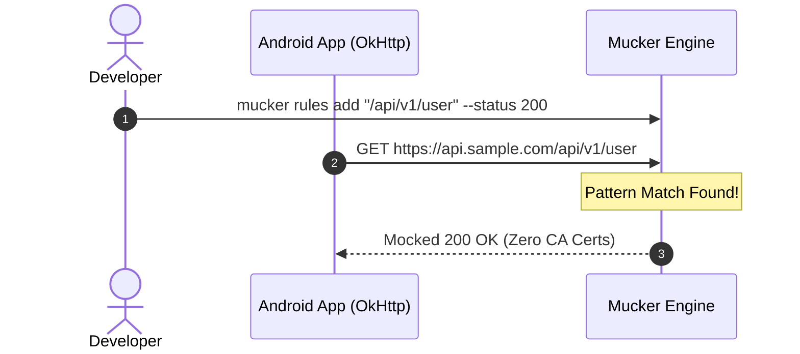

## 1. Add Dependencies via JitPack

Add the JitPack repository in your root `settings.gradle.kts` (or `build.gradle.kts`):

```kotlin
dependencyResolutionManagement {
    repositories {
        google()
        mavenCentral()
        maven { url = uri("https://jitpack.io") }
    }
}
```

In your application module's `build.gradle.kts`, choose between the all-in-one bundle, headless interceptor, or in-app dashboard:

```kotlin
dependencies {
    // OkHttp (host app dependency)
    implementation("com.squareup.okhttp3:okhttp:4.12.0")

    // Option A: Full Bundle (Headless Interceptor + In-App WebView Dashboard)
    debugImplementation("com.github.yongjhih.mucker:mucker:1.0.0")

    // Option B: Headless Interceptor (Zero UI, pure OkHttp mock engine & CDP server)
    // debugImplementation("com.github.yongjhih.mucker:mucker-interceptor:1.0.0")

    // Option C: In-App Web Dashboard (MuckerActivity, Notification Drawer, and Web Assets)
    // debugImplementation("com.github.yongjhih.mucker:mucker-dashboard:1.0.0")

    // Release: Clean zero-overhead stubs
    releaseImplementation("com.github.yongjhih.mucker:mucker-noop:1.0.0")
}
```

---

## 2. Initialize in Application

In your `Application` class, call `Mucker.install(this)`:

```kotlin
package com.example.myapp

import android.app.Application
import io.github.mucker.Mucker
import io.github.mucker.MuckerConfig

class MyApp : Application() {
    override fun onCreate() {
        super.onCreate()

        // Initialize Mucker in debug builds
        Mucker.install(
            context = this,
            config = MuckerConfig(
                port = 8080,               // Default server port
                showNotification = true,   // Display persistent status notification
                autoStart = true           // Start embedded micro-server on app launch
            )
        )
    }
}
```

---

## 3. Attach Interceptor to OkHttpClient

Add `Mucker.interceptor` to your `OkHttpClient.Builder()`:

```kotlin
import io.github.mucker.Mucker
import okhttp3.OkHttpClient

val okHttpClient = OkHttpClient.Builder()
    // Attach Mucker Interceptor
    .addInterceptor(Mucker.interceptor)
    .build()
```

If you also use Chucker or HttpLoggingInterceptor, we recommend placing `Mucker.interceptor` first or right before logging:

```kotlin
val okHttpClient = OkHttpClient.Builder()
    .addInterceptor(Mucker.interceptor) // Mocker handles or shorts-circuit requests
    .addInterceptor(ChuckerInterceptor.Builder(context).build())
    .build()
```

---

## 4. Open the Mucker Dashboard

### Method A: Directly on Phone (In-App WebView)
1. Run your app in debug mode.
2. Swipe down the Android notification drawer and tap the **"Mucker Active"** notification.
3. The in-app Mucker Dashboard will open immediately!

### Method B: Computer Browser via Wi-Fi
If your computer and Android phone are on the same Wi-Fi network:
1. Note the phone IP shown on the notification or app status card (e.g., `192.168.1.50`).
2. Open your desktop browser and navigate to:
   ```
   http://192.168.1.50:8080
   ```

### Method C: Computer Browser via USB / Emulator (Recommended)
Install the Mucker CLI or run ADB:

```bash
# Using Mucker CLI
npx mucker forward
npx mucker open

# Or using adb directly
adb forward tcp:8080 tcp:8080
open http://localhost:8080
```

---

## 5. Adding Your First Mock Rule

### From the Web Dashboard:
1. Click **"+ New Mock"**.
2. Enter URL pattern: `.*/api/v1/user.*`.
3. Choose Status Code: `200 OK`.
4. Enter response body:
   ```json
   {
     "id": "usr_99",
     "name": "Jane Developer",
     "role": "Admin"
   }
   ```
5. Click **"Save Rule"**.

### From the Command Line:
```bash
mucker rules add "/api/v1/user" --status 200 --body '{"name":"Jane Developer"}'
```



Every subsequent OkHttp call matching this URL will instantly return the mock JSON with zero network roundtrip and zero certificate issues!
