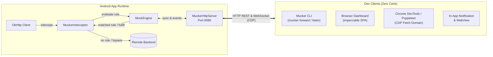

  

  

    ⚡ Zero CA Certs Required
    •
    Chrome DevTools Protocol (CDP)
  

  <h1>
    Muck with your network. 
    Zero certs required.
  </h1>

  

    The missing mocking sidekick for OkHttp. Intercept, pause, and inject mock API responses on Android in real time — via phone WebView, desktop browser, CLI, or automated CDP scripts.
  

  

    <a href="{{ '/getting-started' | relative_url }}" class="btn btn-primary">
      Get Started
      <svg width="16" height="16" viewBox="0 0 24 24" fill="none" stroke="currentColor" stroke-width="2"><path d="M5 12h14M12 5l7 7-7 7"/></svg>
    </a>
    <a href="{{ '/dashboard/' | relative_url }}" class="btn btn-secondary" style="border-color: #6366f1; color: #818cf8; font-weight: 600;">
      ⚡ Live Dashboard
    </a>
    <a href="{{ '/cdp-history' | relative_url }}" class="btn btn-secondary">
      CDP Evolution & History
    </a>
    <a href="https://github.com/yongjhih/mucker" class="btn btn-github" target="_blank" rel="noopener">
      View on GitHub
    </a>
  

  <!-- Hero Visual / Terminal Mockup -->
  

    

      
      
      
      bash — mucker cli & cdp inspector
    

    

      
$ mucker forward

      
✔ Detected 1 device: Pixel_8_Pro

      
✔ Successfully forwarded tcp:8080 -> tcp:8080

      
Open Dashboard: http://localhost:8080

       
      
$ mucker rules add "/api/v1/user/profile" --status 200 --body '{"name":"Alex Mercer","role":"Lead"}'

      
✔ Added mock rule [rule_user]: GET /api/v1/user/profile -> 200 OK

       
      
$ mucker listen

      
Connecting to Mucker live event stream at ws://localhost:8080/devtools/page...

      
[MOCKED] 200 https://dummyjson.com/api/v1/user/profile (2ms)

      
[PAUSED] POST https://dummyjson.com/api/v1/checkout (Waiting for dev action...)

    

  

<!-- Features Section -->
<section class="features-section">
  

    <h2>Why Mucker?</h2>
    
Solving the fundamental pain points of mobile network inspection and mocking.

  

  

    

      

        <svg width="24" height="24" fill="none" stroke="currentColor" stroke-width="2" viewBox="0 0 24 24"><path d="M12 22s8-4 8-10V5l-8-3-8 3v7c0 6 8 10 8 10z"/></svg>
      

      <h3>Zero CA Certificates</h3>
      
No more struggling with Android 7.0+ user certificate restrictions or modifying <code>network_security_config.xml</code>. Intercepts directly in the OkHttp application layer.

    

    

      

        <svg width="24" height="24" fill="none" stroke="currentColor" stroke-width="2" viewBox="0 0 24 24"><path d="M21 16V8a2 2 0 0 0-1-1.73l-7-4a2 2 0 0 0-2 0l-7 4A2 2 0 0 0 3 8v8a2 2 0 0 0 1 1.73l7 4a2 2 0 0 0 2 0l7-4A2 2 0 0 0 21 16z"/></svg>
      

      <h3>Native Chrome DevTools (CDP)</h3>
      
Full support for the modern CDP <strong>Fetch Domain</strong> (<code>Fetch.enable</code>, <code>Fetch.requestPaused</code>, <code>Fetch.fulfillRequest</code>). Connect via Puppeteer, Playwright, or browser.

    

    

      

        <svg width="24" height="24" fill="none" stroke="currentColor" stroke-width="2" viewBox="0 0 24 24"><path d="M4 6h16M4 12h16m-7 6h7"/></svg>
      

      <h3>In-App + Desktop Web Dashboard</h3>
      
Click the system notification on your phone to open the in-app WebView, or open <code>http://&lt;phone-ip&gt;:8080</code> on your laptop. Same impeccable real-time SPA dashboard.

    

    

      

        <svg width="24" height="24" fill="none" stroke="currentColor" stroke-width="2" viewBox="0 0 24 24"><path d="M13 10V3L4 14h7v7l9-11h-7z"/></svg>
      

      <h3>Zero Native C++ Drag</h3>
      
Unlike Flipper which dragged in OpenSSL, Boost, and Folly C++ libraries that broke builds, Mucker is 100% lightweight Kotlin with zero build overhead and safe no-op stubs.

    

    

      

        <svg width="24" height="24" fill="none" stroke="currentColor" stroke-width="2" viewBox="0 0 24 24"><path d="M12 8v4l3 3m6-3a9 9 0 11-18 0 9 9 0 0118 0z"/></svg>
      

      <h3>Live Breakpoint Interception</h3>
      
Pause requests in mid-air! Inspect request payload, tweak response body, modify status codes, and click <em>Fulfill</em> or <em>Pass Through</em> with automatic safe timeout protection.

    

    

      

        <svg width="24" height="24" fill="none" stroke="currentColor" stroke-width="2" viewBox="0 0 24 24"><path d="M8 9l3 3-3 3m5 0h3M5 20h14a2 2 0 002-2V6a2 2 0 00-2-2H5a2 2 0 00-2 2v12a2 2 0 002 2z"/></svg>
      

      <h3>Mucker CLI & AI Skills</h3>
      
Drive mocking directly from terminal or AI coding agents. One command to forward ports, add latency rules, stream live traffic, and mock payment failures.

    

    

      

        <svg width="24" height="24" fill="none" stroke="currentColor" stroke-width="2" viewBox="0 0 24 24"><path d="M19 11H5m14 0a2 2 0 012 2v6a2 2 0 01-2 2H5a2 2 0 01-2-2v-6a2 2 0 012-2m14 0V9a2 2 0 00-2-2M5 11V9a2 2 0 012-2m0 0V5a2 2 0 012-2h6a2 2 0 012 2v2M7 7h10"/></svg>
      

      <h3>Modular Dashboard & BYOF</h3>
      
Decoupled and open. Plug in custom panels (GraphQL, Chaos) or rewrite the frontend with React, Vue, or Svelte and bundle it into your APK.

    

  

</section>

<!-- Architecture Flow Section with Mermaid -->
<section class="features-section" style="margin-top: 48px;">
  

    <h2>End-to-End Workflow</h2>
    
Zero-configuration synchronization between OkHttp, the Embedded Micro-Server, and developer clients.

  

  

  

</section>

