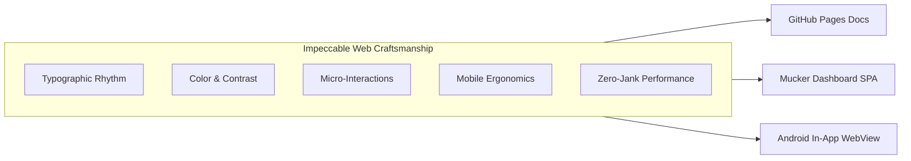

# Web Craftsmanship Standards

> **"Software should not only function reliably; its interface should exhibit clarity, intent, and exceptional craft."**
> 
> Mucker's web surfaces — including the documentation site on GitHub Pages and the standalone/in-app Web Dashboard SPA — strictly adhere to the **Impeccable Web Craftsmanship** guidelines inspired by [Paul Bakaus's Impeccable design system](https://github.com/pbakaus/impeccable).



---

## 1. Core Principles of Impeccable Web Design

### 1.1 Typographic Rhythm & Scale
* **Typefaces**: 
  - Sans-serif: `Inter`, system fallback `-apple-system, BlinkMacSystemFont, "Segoe UI", Roboto, sans-serif`.
  - Monospace: `JetBrains Mono`, `ui-monospace`, `Consolas`, monospace.
* **Proportional Scaling**: Headings, body text, and badges follow an 8pt modular grid.
* **Line Heights**: `1.6` to `1.65` for body text and code listings; `1.2` to `1.3` for high-density headings.
* **Tabular Numerics**: All numeric values (timestamps, latency, HTTP status codes, byte sizes) declare `font-variant-numeric: tabular-nums` to eliminate jitter when streaming live telemetry.

### 1.2 Harmonious Color & WCAG Contrast
* **Theme Support**: Seamless Dark Mode (default: `#090d16` base, `#0f172a` surface) and Light Mode (`#f8fafc` base, `#ffffff` surface).
* **WCAG 2.1 AA/AAA Compliance**: All body and interactive copy maintains a minimum contrast ratio of `4.5:1` (and `7:1` for AAA text).
* **Semantic Verbs & Status**:
  - `GET`: Cyan / Emerald (`#38bdf8` / `#10b981`)
  - `POST`: Blue (`#6366f1`)
  - `PUT` / `PATCH`: Orange (`#f59e0b`)
  - `DELETE`: Crimson (`#ef4444`)
  - HTTP `2xx`: `#10b981` (Success)
  - HTTP `3xx`: `#38bdf8` (Redirect)
  - HTTP `4xx` / `5xx`: `#ef4444` (Error)
  - Mocked Badge: `#a855f7` (Purple / Lavender)

### 1.3 Delightful Micro-Interactions & Transitions
* **GPU Hardware Acceleration**: Transitions only modify `opacity` and `transform` to ensure consistent 60fps rendering without triggering browser reflows.
* **Snappy Timings**: Micro-interactions use `120ms` to `200ms cubic-bezier(0.4, 0, 0.2, 1)`.
* **Tactile Feedback**:
  - Buttons scale subtly down on press: `:active { transform: scale(0.97); }`.
  - Copy buttons provide immediate visual confirmation: checkmark icon, "Copied!" text, and border highlight.
  - Group disclosure toggles animate smoothly (`transform: rotate(90deg)`).

### 1.4 Mobile & Touch Ergonomics
* **Minimum Tap Target**: Every interactive element measures at least `44×44px` on touch viewports.
* **Gesture Safe Zones**: Scrolling containers account for Android 14+ navigation bars and gesture pill zones (`env(safe-area-inset-bottom)`).
* **Collapsible Details**: On viewports `< 768px`, the list and inspector switch to an ergonomically stacked layout, allowing the developer to navigate between request list and detailed inspect view without cramping.

### 1.5 Code Snippet & Diagram Craftsmanship
* **Unified Syntax Highlighting**: Multi-engine tokenization supporting Rouge (Jekyll GFM), Highlight.js, and Prism.js tokens with distinct colors for strings, numbers, keywords, and functions.
* **Interactive Mermaid Diagrams**: Embedded Mermaid diagrams render directly into vector SVG with automatic dark/light theme switching.
* **Header & Copy Bar**: Code blocks feature an explicit uppercase language badge (e.g. `KOTLIN`, `JAVASCRIPT`, `BASH`) and a 1-click clipboard copy action.

---

## 2. Implementation in Mucker Web Dashboard

The Mucker Web Dashboard SPA (`dashboard/index.html`) demonstrates these principles in real-time network inspection:

| Component | Impeccable Design Feature |
| :--- | :--- |
| **Floating Timeline Bar** | Anchored floating glassmorphic toolbar at top-left over the canvas, saving 36px vertical screen space while offering zoom (`+`, `−`, `Fit`) and interval selection brush controls. |
| **Endpoint Aggregation** | Consecutive identical endpoints automatically collapse into a single row with an `×N` counter badge, expanding on demand to inspect each historical retry without visual clutter. |
| **Collapsible JSON Tree** | Recursive tree rendering with interactive disclosure toggles, syntax colorized keys and values, and Expand All / Collapse All actions. |
| **Smart Live Mocking** | Real-time payload editor with context-aware smart detection: unmocked endpoints offer `⚡ Mock Endpoint with this Data`, while active rules display `💾 Update Mock Data`. |

---

## 3. Developer & Agent Craftsmanship Audit Checklist

Before releasing changes to either the documentation or the dashboard, verify the following checklist:

- [ ] **Contrast Check**: Run DevTools accessibility tree audit. Ensure all foreground text meets at least 4.5:1 contrast against its background.
- [ ] **Mobile Touch Test**: Test on mobile or Android emulator WebView (`412×915`). Confirm buttons are easily tappable with no accidental zooming.
- [ ] **Code Block Styling**: Check that every ``` code block includes a language identifier and renders syntax highlighting.
- [ ] **Mermaid Diagram Legibility**: Ensure all nodes have readable contrast in both Dark and Light modes.
- [ ] **Memory & Reflows**: Confirm no memory leaks in WebSocket listeners or Canvas render loops.
