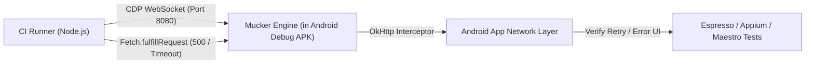

# Chaos Engineering & Automated CI/CD Testing with Mucker

This example demonstrates how **QA Engineers, SDETs, and Mobile DevOps** can inject network chaos (e.g. random HTTP 500 errors, high latency, simulated timeouts) directly into native Android OkHttp apps during automated CI/CD runs **without rooting, proxies, or installing CA certificates**.



---

## 1. Why Mobile Chaos Engineering?

Real mobile users experience flaky connections, server deployments, microservice outages, and 504 timeouts. Traditional mock proxies require:
- Installing and trusting custom root CA certificates on the Android system.
- Proxy configuration with network security config xml (`res/xml/network_security_config.xml`).
- SSL pinning bypasses (which risk masking real security regressions).

**Mucker eliminates all of this.** Because Mucker runs directly inside OkHttp via a zero-cert local CDP server, your existing Node.js test scripts can control, throttle, and mock native network traffic effortlessly.

---

## 2. Quick Start

### Step 1: Forward ADB Port
```bash
adb forward tcp:8080 tcp:8080
```

### Step 2: Run Chaos Injector
```bash
cd examples/chaos-ci
npm install

# Inject 35% failure rate (HTTP 500 + 4000ms timeouts)
node chaos-injector.mjs --rate=0.35 --timeout=4000
```

### Step 3: Trigger App Network Traffic
Tap endpoints in the Android app or run your automated Maestro/Appium/Espresso tests concurrently. Notice how:
* 35% of requests randomly receive HTTP 500 or 504 timeout responses.
* The console outputs real-time logs:
```
[🔥 CHAOS 500] POST https://api.example.com/v1/checkout
[⏳ CHAOS TIMEOUT] GET https://api.example.com/v1/user/profile (delay 4000ms)
[✓ PASS] GET https://dummyjson.com/products
```

---

## 3. GitHub Actions CI/CD Pipeline Integration

Here is a production-ready GitHub Actions workflow snippet demonstrating how to start the Android emulator, launch Mucker chaos injection in the background, and run Android end-to-end tests:

```yaml
name: Android Chaos Resilience CI

on: [push, pull_request]

jobs:
  chaos-test:
    runs-on: macos-14
    steps:
      - uses: actions/checkout@v4

      - name: Set up JDK 17
        uses: actions/setup-java@v4
        with:
          java-version: '17'
          distribution: 'temurin'

      - name: Set up Node.js
        uses: actions/setup-node@v4
        with:
          node-version: '20'

      - name: Build & Install Android Demo App
        run: |
          ./gradlew :app:installDebug

      - name: Setup ADB Port Forwarding
        run: |
          adb forward tcp:8080 tcp:8080

      - name: Start Mucker Chaos Injector in Background
        run: |
          cd examples/chaos-ci
          npm install
          node chaos-injector.mjs --rate=0.4 --timeout=5000 &
          sleep 2

      - name: Run Maestro / Espresso Tests Under Chaos
        run: |
          # Run UI test suite verifying error toast, retry button, and no unhandled crashes
          ./gradlew :app:connectedDebugAndroidTest
```

---

## 4. Puppeteer / Playwright CDP Integration

You can also use your favorite browser automation frameworks (`puppeteer-core` or `playwright`) to control Mucker via the Chrome DevTools Protocol:

```javascript
import puppeteer from 'puppeteer-core';

const browser = await puppeteer.connect({
  browserWSEndpoint: 'ws://127.0.0.1:8080/devtools/page'
});

const page = (await browser.pages())[0];
const client = await page.target().createCDPSession();

// Enable CDP Fetch domain
await client.send('Fetch.enable', {
  patterns: [{ urlPattern: '*/checkout*' }]
});

// Intercept checkout request and mock failure
client.on('Fetch.requestPaused', async (event) => {
  await client.send('Fetch.fulfillRequest', {
    requestId: event.requestId,
    responseCode: 500,
    responseHeaders: [{ name: 'Content-Type', value: 'application/json' }],
    body: Buffer.from(JSON.stringify({ error: 'Chaos Gateway Down' })).toString('base64')
  });
});
```

---

## 5. Summary

With Mucker:
* QA and CI/CD pipelines can test catastrophic backend failures and slow networks safely.
* No proxy servers to maintain.
* Zero certificates or system-level tampering.
